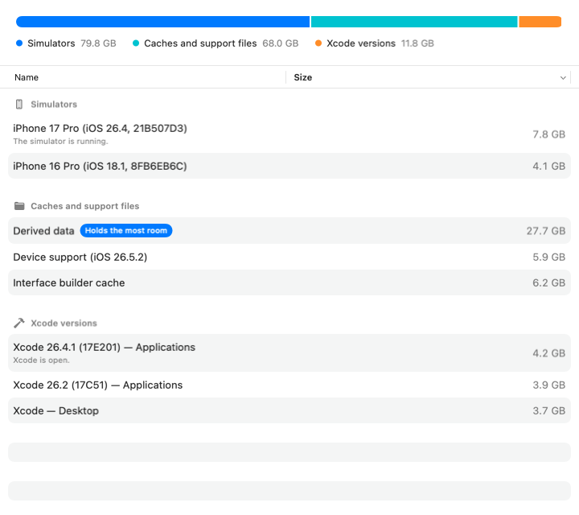

# XcodeReclaim

A macOS app that shows what Xcode has left on disk — where it sits and how much
room it takes — and deletes what you choose.



Xcode leaves derived data, previews, interface builder caches, documentation
caches and device support folders behind; it keeps every simulator you have ever
made; and every copy of Xcode you have downloaded stays where you put it. This
app measures all of it, shows it in one list with the room each one holds, and
deletes the ones you pick — one at a time or several at once.

## What it will not do

**Nothing goes to the trash.** The point is the room, and the trash holds on to
it, so every deletion is permanent. That is why every deletion is confirmed
first, and why the confirmation says what it costs rather than only what it
frees: a simulator takes the apps inside it with it, a copy of Xcode has to be
downloaded again.

It never offers your provisioning profiles, your archives or your settings.

It refuses what it should not touch, and says why in the row: a simulator that is
running, a copy of Xcode that is open, and the copy your command line tools point
at.

## Running it

macOS 15 or later. There is no signed download yet, so build it yourself.

## Building it

The Xcode project is generated rather than kept in the repository:

```bash
brew install xcodegen swiftlint
git lfs install
xcodegen generate
open XcodeReclaim.xcodeproj
```

`git lfs` matters: the UI snapshots are stored with it, and without it the
snapshot tests compare against pointer files. `swift-format` ships with Xcode;
both it and `swiftlint` run clean on the tree.

Tests are ⌘U for the app and its journeys, and `swift test` inside each folder
under `Packages/` for the layers underneath.

## How it is put together

Each layer is its own package and knows only the one below it. The screen
decides nothing, the engine knows nothing about a screen or a disk, and every
decision about threads is taken in one place.

| where | what is in it |
|---|---|
| `Packages/XcodeReclaimCore` | the two values every layer agrees on |
| `Packages/XcodeReclaimEngine` | measuring and deleting, with no idea of a screen or a disk |
| `Packages/XcodeReclaimInfra` | the real disk, `simctl`, `mdfind` and `xcode-select` |
| `Packages/XcodeReclaimPresentation` | what the screen says, as values |
| `Packages/XcodeReclaimUI` | the SwiftUI screen, which is handed a model and closures |
| `XcodeReclaim` | the composition root: where the parts meet, and where threading lives |
| `XcodeReclaimTests` | the journeys through the whole app |
| `features/` | the scenarios the tests are named for, word for word |
| `contracts/architecture.yml` | the layers, the parts, and what each may use |
| `mutants/` | the mutation sweeps, one file per package |
| `readings.md` | the latest measurement of the suite: time, coverage, mutation |

## Licence

MIT — see [LICENSE](LICENSE).
